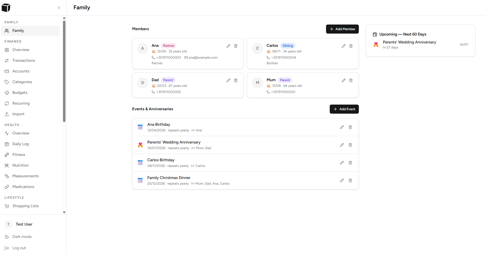
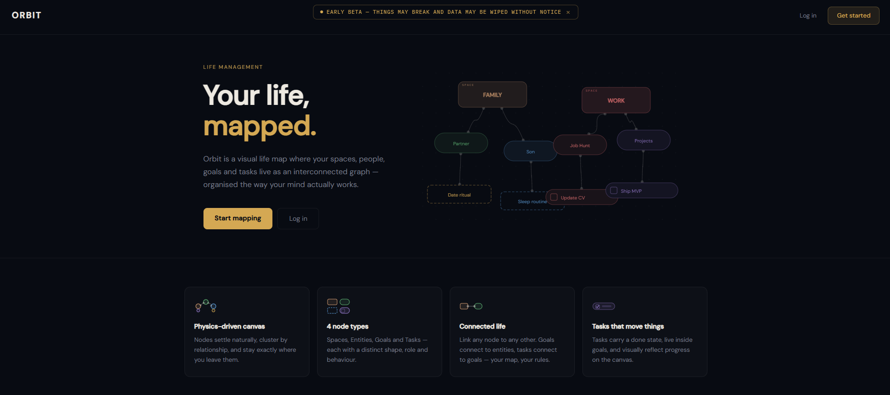
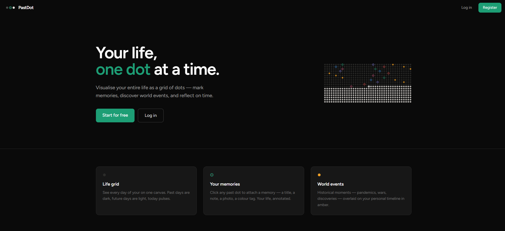

<h2 align="left">
  👨🏻‍💻 Fullstack Developer
</h2>

<p align="left">
Fullstack developer focused on custom WordPress development, Laravel applications, API integrations, and business automation. 
I enjoy building maintainable solutions that solve real-world problems and deliver long-term value.
</p>

---

## 🚀 Current Focus

```yaml
Location: Portugal
Role: Fullstack Developer
Availability: Open to Work
Specialization: WordPress Development

Currently Building:
  - Personal Projects/Tools
  - Custom WordPress Platforms
  - Laravel Applications
  - Internal Productivity Tools

Currently Learning:
  - Next.js
  - Advanced React
  - Laravel Ecosystem
  - AI Assisted Development

Open To:
  - Remote Opportunities
  - Freelance Projects
  - Technical Challenges (not live coding) 🫠
```

---

## 🏢 Some Professional Projects

<table>
<tr>
<td width="25%">
    
### 🛒 E-Commerce Store

**Highlights**

* Product customization tool
* Custom artwork overlay system
* WooCommerce integration

[Website](https://toranja.com/)
<br/>
</td>
<td width="25%">

### 🏭 Industrial Sector Website

**Highlights**

* Multi-level taxonomy architecture
* Advanced search and filtering
* Custom content management workflow

[Website](https://mapengenhariaeconstrucao.pt/)

<br/>
</td>

<td width="25%">

### 💊 Healthcare Platform

**Highlights**

* External API integration
* Complaints submission workflow
* Custom form processing

[Website](https://preveris.pt/)

<br/>
</td>
<td width="25%">

### 🏠 Corporate Website

**Highlights**

* Custom WordPress theme
* Dynamic content management
* SEO/Performance optimization

[Website](https://connectdigital.global/)
  
<br/>
</td>
</tr>
</table>

> **Disclaimer:** The projects listed above represent work that I contributed to during their development and delivery phases. Websites and platforms may have been modified, redesigned, maintained, migrated, or updated by clients, internal teams, or third parties after project completion. As a result, current implementations, functionality, performance, content, design, or technical architecture may differ from the original work delivered.

---

## 📸 Personal Projects

<table>
<tr>
<td width="50%">


<br>

###  LifeStyle Manager

Managing your finances, health, tasks, habits, and more.

Laravel + React + MySQL

✔ Personal Use Tools     
✔ Dashboard Analytics    
✔ Charts & Reports    


</td>

<td width="50%">


<br>

### Orbit

A visual life management tool

Next.js + PostgreSQL  + Tailwind

✔ User Management  
✔ Physics-driven canvas    
✔ Live persistence    


</td>
</tr>
<tr>
<td width="50%">


<br>

### CookLab

Personal recipe generator

Next.js + SQLite  + Groq Api

✔ Pantry manager     
✔ Scheduled delivery    
✔ Preferences + History  


</td>

<td width="50%">


<br>

### PastDot

Personal & World memories visualisation web app

React + SQLite  + Vite

✔ User Management       
✔ Historical world events   
✔ Stats strip + Sidebar offscreen    


</td>
</tr>
</table>

---

## 🎯 Highlights

- 5+ years building WordPress solutions
- Custom plugins and Gutenberg blocks
- REST API and third-party integrations
- Laravel and React applications
- Business automation and workflow systems

---

## 🛠 Tech Stack

### Backend


### Frontend


### Databases 


### Dev Tools


### Env


### WP Related


---

## 📊 GitHub Analytics

<p align="left">


</p>

---

## ⚙️ Developer Mindset

```yaml
# Solve the problem before scaling it.
# Simple beats clever.
# Working software beats perfect plans.
# Automate repetitive work.
# Leave the codebase better than you found it.
```
---

## 🌐 Connect

<p align="left">

<a href="https://www.linkedin.com/in/jo%C3%A3o-dias-7908075b/">
  
</a>

<a href="mailto:jpnd.trabalho@gmail.com">
  
</a>

</p>
